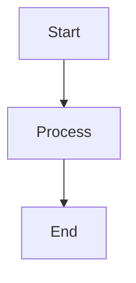

# PyCon Athens 2024 Presentation

**How I Learned to Stop Worrying and Love Raw Events: Event Sourcing & CQRS with FastAPI and Celery**

## Overview

This repository contains the presentation materials for the PyCon Athens 2024 talk about Event Sourcing and CQRS using Python technologies.

## Files

- `presentation.md` - The main presentation in Marp format
- `notes.md` - Detailed speaker notes for each slide
- `Makefile` - Build automation for generating PDFs and diagrams
- `diagrams/source/` - Mermaid diagram source files
- `diagrams/generated/` - Generated diagram images (created by Makefile)

## Quick Start

### 1. Setup

```bash
# Install dependencies and setup directories
make setup
```

This will install:
- Marp CLI for presentation generation
- Mermaid CLI for diagram generation
- Create necessary directories

### 2. Generate Presentation

```bash
# Generate PDF
make create-presentation

# Generate HTML
make create-html

# Generate PowerPoint
make create-pptx
```

### 3. Preview Locally

```bash
# Start local server for preview
make serve-presentation
```

Then open http://localhost:8080 in your browser.

## Available Commands

Run `make help` to see all available commands:

```bash
make help
```

### Key Commands

- `make setup` - Complete initial setup
- `make create-presentation` - Generate PDF presentation
- `make serve-presentation` - Preview locally
- `make generate-diagrams` - Generate diagrams from Mermaid files
- `make clean` - Clean generated files
- `make watch` - Watch for changes and auto-regenerate

## Customization

### Adding Diagrams

1. Create Mermaid files in `diagrams/source/` with `.mmd` extension
2. Run `make generate-diagrams` to generate PNG images
3. Reference images in your presentation

Example diagram file (`diagrams/source/my-diagram.mmd`):


### Modifying the Presentation

1. Edit `presentation.md` using the Marp syntax
2. Run `make create-presentation` to regenerate PDF
3. Use `make serve-presentation` for live preview

### Updating Speaker Notes

1. Edit `notes.md` with your speaking notes
2. Each slide has timing, key points, and speaking notes
3. Adjust timing and content as needed

## Presentation Structure

The presentation follows this 30-minute structure:

1. **Intro & Motivation** (7 min) - Slides 1-5
2. **Core Concepts** (5 min) - Slides 6-8  
3. **Architecture Walkthrough** (12 min) - Slides 9-16
4. **Real-World Patterns** (8 min) - Slides 17-22
5. **Key Takeaways** (3 min) - Slides 23-27

## Theme

The presentation uses a Python-themed color scheme:
- Primary: `#306998` (Python Blue)
- Secondary: `#FFD43B` (Python Yellow)
- Background: `#1E1E1E` (Dark)
- Text: `#E0E0E0` (Light)

## Dependencies

- Node.js and npm (for Marp and Mermaid CLI)
- Make (for build automation)

## Troubleshooting

### Marp Installation Issues

```bash
# If global install fails, try:
npm install -g @marp-team/marp-cli --unsafe-perm
```

### Mermaid Installation Issues

```bash
# If global install fails, try:
npm install -g @mermaid-js/mermaid-cli --unsafe-perm
```

### Permission Issues

```bash
# On macOS/Linux, you might need:
sudo npm install -g @marp-team/marp-cli @mermaid-js/mermaid-cli
```

## Demo Code

The presentation references a demo that should be built separately. Consider creating:

- FastAPI application with event sourcing
- Celery workers for event processing
- SQLite event store
- Real-time event replay functionality

## Resources

- [Marp Documentation](https://marp.app/)
- [Mermaid Documentation](https://mermaid.js.org/)
- [Event Sourcing Resources](https://martinfowler.com/eaaDev/EventSourcing.html)
- [CQRS Resources](https://martinfowler.com/bliki/CQRS.html)

## License

This presentation is created for PyCon Athens 2024. Feel free to adapt and use for your own presentations. 