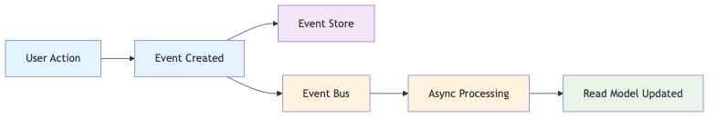
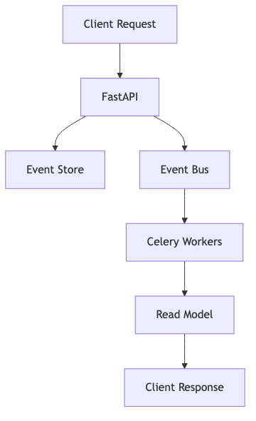

# How I Learned to Stop Worrying and Love Raw Events

## Event Sourcing & CQRS with FastAPI and Celery

**PyCon Athens 2025**

*"Gentlemen, you can't fight in here! This is the War Room!"*

---

# Who Am I?

- **Staff Engineer** with 10+ years in Python
- Studied **Physics** → **Computational Physics** → **Software Engineering**
- **Passionate about building systems** with quality

## **My journey**: From "Events are too complex!" to "Events are the solution to complexity!"

---

# What We'll Discuss

## Core Principles
- **Event Sourcing**: Store every change as an immutable event
- **CQRS**: Separate read and write concerns

## Python Ecosystem Examples
- **FastAPI**: API surface for commands and queries
- **Celery**: Async event processing
- **Pydantic**: Data validation and modeling

## The Aftermath
- **Real-world patterns** and gotchas
- **Performance considerations**
- **Debugging and testing** in an immutable world

---

# The Nightmare: "Who Deleted My User?"

## A real debugging story:

```python
def delete_user(user_id: int):
    db.delete_user(user_id)
```

## The problem:
**Monday 3:47 PM**: "Sarah's account is missing!"
**Tuesday 9:15 AM**: "When was it deleted? Who did it? Why?"

## What we can't answer:
- ❌ **When** was the user deleted?
- ❌ **Who** deleted the user?
- ❌ **Why** was it deleted?

## **The system has no memory of what happened**

---

# Enter Event Sourcing: The System That Remembers

## We store every change as an immutable event:

```python
UserDeleted(
    event_id=uuid4(),
    aggregate_id="user_123",
    version=5,
    timestamp=datetime.now(),
    event_type="USER_DELETED",
    data={ "deleted_by": "admin_456", "reason": "Account closure request" }
)
```

## Now we can answer everything:
- ✅ **When**: March 15, 3:47 PM
- ✅ **Who**: Admin ID 456
- ✅ **Why**: Account closure request

## **Every action becomes a permanent record**

---


# Core Concepts: The Building Blocks

## 1. Events: Immutable Facts

```python
# Every change becomes an event
UserCreated(
    event_id=uuid4(),
    aggregate_id="user_123",
    version=1,
    timestamp=datetime.now(),
    event_type="USER_CREATED",
    data={"name": "Sarah", "email": "sarah@example.com"}
)
```

## Key principle: **Events are immutable facts** - they never change

## Events belong to ordered sequences (Event Streams):

```python
# A user's complete story
user_stream = [
    UserCreated(...),           # Version 1
    UserNameChanged(...),       # Version 2
    UserEmailChanged(...),      # Version 3
    UserStatusChanged(...),     # Version 4
    UserDeleted(...)            # Version 5
]
```


## **The stream is the source of truth** - rebuild any point in time

---

## 2. Commands: Intent to Change

```python
# Commands represent the intent to change something
CreateUserCommand(
    name="Sarah",
    email="sarah@example.com"
)

ChangeUserEmailCommand(
    user_id="user_123",
    new_email="sarah.new@example.com"
)
```

## **Commands are the entry point** - they represent what we want to do

---

## 3. Queries: Intent to Read (CQRS Separation)

```python
# Queries represent the intent to read something
GetUserQuery(user_id="user_123")
GetUserHistoryQuery(user_id="user_123", from_date="2024-01-01")
GetUsersByStatusQuery(status="active")
```

## **Queries are separate from commands** - different models for different purposes

---

## 3. Aggregates: Domain Logic

```python
class UserAggregate:
    def create_user(self, name: str, email: str) -> UserCreated:
        # Business logic validation
        if not name or not email:
            raise ValueError("Name and email required")

        # Create and return event
        return UserCreated(
            event_id=uuid4(),
            aggregate_id=self.aggregate_id,
            version=self.version + 1,
            timestamp=datetime.now(),
            event_type="USER_CREATED",
            data={"name": name, "email": email}
        )
```

## **Aggregates apply business logic** and create events

---

## 4. Event Store: Source of Truth

```python
# Event Store - append-only storage
await event_store.append_to_stream(
    stream_id="user_123",
    expected_version=0,
    events=[user_created_event]
)

# Retrieve events for replay
events = await event_store.get_stream("user_123")
```

## **Event Store is append-only** - events never change or delete

---

## 5. Projections: Building Read Models

```python
class UserProjection:
    async def handle_user_created(self, event: UserCreated):
        # Build read model from event
        user_data = {
            "user_id": event.aggregate_id,
            "name": event.data["name"],
            "email": event.data["email"],
            "status": "active",
            "created_at": event.timestamp
        }
        await self.read_model.save_user(user_data)
```

## **Projections build optimized read models** from events

---

# How Everything Works Together

## The complete flow:


## **Each interaction follows this pattern** - from command to projection

---


# The Python Way: FastAPI + Celery

## How we implement this in Python:



## Python tools:
- **FastAPI**: API surface for commands/queries
- **Celery**: Async task runner, scalable workers
- **Event Store**: PostgreSQL, EventStoreDB, DynamoDB (with stream support)
- **Event Bus**: RabbitMQ, Kafka, EventBridge, SNS

---

# Mapping: Theory to Python Implementation

## Core Entities → Python Implementation:

| **Theory** | **Python Implementation** |
|------------|---------------------------|
| **Events** | Pydantic models with validation |
| **Event Streams** | PostgreSQL tables with versioning |
| **Aggregates** | Domain classes with apply() methods |
| **Command Handlers** | FastAPI dependency injection |
| **Event Store** | Repository pattern with async/await |
| **Projections** | Celery tasks with event handlers |
| **Read Models** | Optimized database views |

## **Python ecosystem provides excellent tools for each concept**



---

# FastAPI: The Command Interface

## Real implementation with Pydantic:

```python
@router.post("/users")
async def create_user(
    user_data: dict,
    infrastructure_factory: InfrastructureFactoryDep = None
):
    # Create command with validation
    command = CreateUserCommand(
        name=user_data["name"],
        email=user_data["email"]
    )

    # Get handler and process
    handler = infrastructure_factory.create_create_user_command_handler()
    await handler.handle(command)

    # Return immediately (async processing)
    return {"status": "accepted", "user_id": command.user_id}
```

---

# Command Handlers: Business Logic

## How we structure command processing:

```python
class CreateUserCommandHandler:
    async def handle(self, command: CreateUserCommand) -> None:
        # Load existing aggregate from stream (if exists)
        stream_id = command.user_id
        events = await self.event_store.get_stream(stream_id)
        user = UserAggregate(stream_id)

        # Reconstruct state from events
        for event in events:
            user.apply(event)

        # Call domain method (validates and creates event)
        event = user.create_user(command.name, command.email)

        # Append to stream with version check
        await self.event_store.append_to_stream(stream_id, len(events), [event])

        # Publish to event bus
        await self.event_bus.publish(event)
```

## **Command Handler orchestrates: Stream-based Event Store + Event Bus**

---

# Celery: Async Task Runner & Scalable Workers

## Event processing tasks:

```python
@app.task(name="process_user_event")
def process_user_event_task(event_data: Dict[str, Any]) -> None:
    """Process user event via Celery task."""
    process_user_event_async_sync = async_to_sync(process_user_event_async)
    process_user_event_async_sync(event_data=event_data)

async def process_user_event_async(event_data: Dict[str, Any]) -> None:
    # Business logic
    event = Event(**event_data)
    handler = infrastructure_factory.create_user_event_handler()
    await handler.handle(event)
```

---

# Projections: Event-Driven Read Models

## How projections build read models:

```python
class UserProjection:
    async def handle_user_created(self, event: Event) -> None:
        # Build read model from event
        user_data = {
            "aggregate_id": event.aggregate_id,
            "name": event.data.get("name"),
            "email": event.data.get("email"),
            "status": event.data.get("status"),
            "created_at": event.timestamp,
        }

        # Save to read model
        await self.read_model.save_user(user_data)
```

---

# FastAPI: Query Interface

## How we expose read models:

```python
@users_router.get("/{user_id}")
async def get_user(
    user_id: str,
    infrastructure_factory: InfrastructureFactoryDep = None
) -> Dict[str, Any]:
    # Create query handler
    query_handler = infrastructure_factory.create_get_user_query_handler()
    query = GetUserQuery(user_id=user_id)
    user = await query_handler.handle(query)
    return {"status": "success", "user": user.dict()}

@users_router.get("/{user_id}/history")
async def get_user_history(user_id: str, from_date: Optional[str] = None):
    # Get event history from event store
    query_handler = infrastructure_factory.create_get_user_history_query_handler()
    query = GetUserHistoryQuery(user_id=user_id, from_date=from_date)
    events = await query_handler.handle(query)
    return {"status": "success", "events": [event.dict() for event in events]}
```

---

# The Aftermath: Real-World Patterns & Gotchas

## What happens when you actually build this?

- **Eventual consistency**: Why it's a feature, not a bug
- **Performance challenges**: When replaying becomes slow
- **Debugging superpowers**: What debugging looks like in an immutable world
- **The dark side**: When NOT to use event sourcing

## **Let's talk about the real challenges**

---

# Eventual Consistency: The Feature Nobody Talks About

## The story: "Why isn't my data updated?"

```
User creates account → Event stored → API returns success ✅
                    ↓
              Event processing (async) ⏳
                    ↓
              Read model updated (eventually) ✅
```

## The reality:
- **User sees success immediately** - great UX
- **Data appears in UI within seconds** - acceptable
- **Processing can retry on failure** - resilient

## **Eventual consistency is a feature, not a bug**

---

# When Event Sourcing Goes Wrong

## The performance nightmare:

```python
# The problem: Replaying 10,000 events
def get_user_state(user_id: str):
    events = event_store.get_stream(user_id)  # 10,000 events!
    return replay_events(events)  # Takes 5 seconds 😱
```

## The solution: Snapshots

```python
# The fix: Start from a snapshot
def get_user_state(user_id: str):
    snapshot = get_latest_snapshot(user_id)  # Current state
    recent_events = get_events_since_snapshot(user_id, snapshot.version)
    return replay_from_snapshot(snapshot, recent_events)  # 50ms ✅
```

## **Performance is a feature you have to design for**

---

# Debugging Superpowers: The Immutable World

## The story: "Something broke at 3:47 PM"


```python
# Traditional debugging: "I don't know what happened"
def debug_issue():
    # Check logs... maybe?
    # Check database... current state only
    # Ask users... unreliable
    pass

# Event sourcing debugging: "I can see exactly what happened"
def debug_issue(user_id: str, timestamp: datetime):
    events = event_store.get_events(user_id, around=timestamp)

    print(f"User {user_id} at {timestamp}:")
    for event in events:
        print(f"  {event.timestamp}: {event.type} - {event.data}")

    # Replay to see exact state
    state = replay_events(events)
    print(f"State: {state}")
```

## **Every change is recorded - nothing is lost**

---

# The Dark Side: When NOT to Use Event Sourcing

## Event sourcing is NOT for:

- **Simple CRUD applications** - overkill
- **Teams new to distributed systems** - steep learning curve
- **Systems with simple audit requirements** - traditional logging suffices
- **Performance-critical reads** - eventual consistency overhead

## **Event sourcing is for systems that need to explain themselves**

---

# Real-World Trade-offs

## What you gain:
- ✅ **Complete audit trail** - every change recorded
- ✅ **Time travel** - see any point in history
- ✅ **Debugging superpowers** - trace every decision
- ✅ **Scalability** - separate read/write concerns

## What you lose:
- ❌ **Simplicity** - more complex than CRUD
- ❌ **Immediate consistency** - eventual consistency
- ❌ **Storage overhead** - events take more space
- ❌ **Learning curve** - new patterns to master

## **Event sourcing is a trade-off, not a silver bullet**

---

# Key Takeaways

## What we learned:

1. **Event sourcing is about building systems that can explain themselves**
2. **Python + FastAPI + Celery are more than capable for serious architecture**
3. **Eventual consistency is a feature, not a bug**
4. **Performance requires design - snapshots, indexing, caching**
5. **Event sourcing is not for every system - know when to use it**

## **The goal**: Build systems that can explain themselves 6 months from now

---

# Thank You!

## How I Learned to Stop Worrying and Love Raw Events

**Event Sourcing & CQRS with FastAPI and Celery**

**PyCon Athens 2025**

Questions? Let's discuss!
