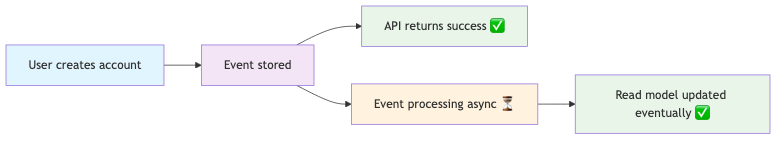

# How I Learned to Stop Worrying and Love Raw Events

## Event Sourcing & CQRS with FastAPI and Celery

**PyCon Athens 2025**

---

# Who Am I?

- **Staff Engineer** with 10+ years in Python
- Studied **Physics** → **Computational Physics** → **Software Engineering**
- **Passionate about building systems** with quality

## **My journey**: From "Events are too complex!" to "Events are the solution to complexity!"

---

# What We'll Discuss

## Core Principles
- **Event Sourcing**: Store every change as an immutable event
- **CQRS**: Separate read and write concerns

## Python Ecosystem Examples
- **FastAPI**: API surface for commands and queries
- **Celery**: Async event processing
- **Pydantic**: Data validation and modeling

## The Aftermath
- **Real-world patterns** and gotchas
- **Performance considerations**
- **Debugging and testing** in an immutable world

---

# The Nightmare: "Who Deleted My User?"

## A real debugging story:

```python
def delete_user(user_id: int):
    db.delete_user(user_id)
```

## The problem:
**Monday 3:47 PM**: "Sarah's account is missing!"
**Tuesday 9:15 AM**: "When was it deleted? Who did it? Why?"

## What we can't answer:
- ❌ **When** was the user deleted?
- ❌ **Who** deleted the user?
- ❌ **Why** was it deleted?

## **The system has no memory of what happened**

---

# Enter Event Sourcing: The System That Remembers

## We store every change as an immutable event:

```python
UserDeleted(
    event_id=uuid4(),
    aggregate_id="user_123",
    version=5,
    timestamp=datetime.now(),
    event_type="USER_DELETED",
    data={ "deleted_by": "admin_456", "reason": "Account closure request" }
)
```

## Now we can answer everything:
- ✅ **When**: March 15, 3:47 PM
- ✅ **Who**: Admin ID 456
- ✅ **Why**: Account closure request

## **Every action becomes a permanent record**

---


# Core Concepts: Events

## Immutable Facts

**Events are immutable facts** that represent state changes in the system.

## Example:
**User Created Event** - John Doe, john@example.com, March 15

## Key characteristics:
- **Immutable**: Once created, events never change
- **Facts**: They represent what actually happened
- **Complete**: Each event contains all necessary data
- **Versioned**: Events have sequence numbers for ordering

## Key principle: **Events are immutable facts** - they never change

---

# Core Concepts: Event Streams

## Ordered Sequences

**Event streams are ordered sequences** of events for a specific aggregate.

## Example:


## Key characteristics:
- **Ordered**: Events have strict chronological ordering
- **Complete**: Contains the full history of an aggregate
- **Replayable**: Can rebuild any point in time
- **Source of truth**: The definitive record of what happened

## **The stream is the source of truth** - rebuild any point in time

---

# Core Concepts: Commands

## Intent to Change

**Commands represent the intent** to change the system state.

## Example:
**"Create a new user account"**

## Key characteristics:
- **Intent**: They express what we want to happen
- **Validation**: Can be validated before execution
- **Idempotent**: Safe to retry if needed
- **Entry point**: The starting point for all changes

## **Commands are the entry point** - they represent what we want to do

---

# Core Concepts: Queries

## Intent to Read (CQRS Separation)

**Queries represent the intent** to read data from the system.

## Example:
**"Show me user John Doe's profile"**

## Key characteristics:
- **Read-only**: They never change system state
- **Optimized**: Designed for specific read patterns
- **Separate models**: Different from command models (CQRS)
- **Fast**: Optimized for quick data retrieval

## **Queries are separate from commands** - different models for different purposes

---

# Core Concepts: Aggregates

## Domain Logic

**Aggregates contain domain logic** and apply business rules to create events.

## Example:
- User email must be unique
- Cannot delete already deleted user

## Key characteristics:
- **Business rules**: Enforce domain-specific validation
- **State management**: Maintain current state from events
- **Event creation**: Generate new events based on commands
- **Consistency**: Ensure business invariants are maintained

## **Aggregates apply business logic** and create events

---

# Core Concepts: Event Store

## Source of Truth

**Event Store is the append-only storage** for all events in the system.

## Example:
**User John Doe's Event Stream**
- **Event 1**: User Created (March 15, 2:30 PM)
- **Event 2**: Email Changed (March 16, 10:15 AM)

## Key characteristics:
- **Append-only**: Events are never modified or deleted
- **Immutable**: Once written, events are permanent
- **Stream management**: Organizes events by aggregate
- **Optimistic concurrency**: Prevents conflicting writes

## **Event Store is append-only** - events never change or delete

---

# Core Concepts: Projections

## Building Read Models

**Projections build optimized read models** from events for fast querying.

## Example:
- Event: User Created → Action: Create user record
- Event: Email Changed → Action: Update email field

## Key characteristics:
- **Event-driven**: Triggered by new events
- **Read-optimized**: Designed for specific query patterns
- **Denormalized**: Optimized for performance, not normalization
- **Eventually consistent**: Updated asynchronously

## **Projections handle business logic and update read models from events**

---

# How Everything Works Together

## The complete flow:


## **Each interaction follows this pattern** - from command to projection

---


# FastAPI: The Command Interface

## Real implementation with Pydantic:

```python
@router.post("/users")
async def create_user(
    user_data: dict,
    handler: CreateUserCommandHandler = Depends(InfraFactory.create_user_command_handler)
):
    # Create command with validation
    command = CreateUserCommand(
        name=user_data["name"],
        email=user_data["email"]
    )

    # Process command
    await handler.handle(command)

    # Return immediately (event stored successfully) or catch exceptions via middleware
    return {"user_id": command.user_id}
```

## **FastAPI commands accept requests and return immediately after event storage**

---

# Command Handlers: Business Logic

## How we structure command processing:

```python
class CreateUserCommandHandler:
    async def handle(self, command: CreateUserCommand) -> None:
        # Retrieve all events for this aggregate
        events = await self.event_store.get_stream(command.user_id)

        # Create empty aggregate and replay events
        user = UserAggregate(command.user_id)
        for event in events:
            user.apply(event)

        # Call domain method and get new events
        new_events = user.create_user(command.name, command.email)

        # Persist and dispatch events using unit of work
        async with self.uow:
            await self.event_store.append_to_stream(command.user_id, new_events)
            await self.event_handler.dispatch(new_events)
```

## **Command Handler orchestrates: Event Store + Event Handler with Unit of Work**

---

# Event Handler: Celery Integration

## How events are dispatched to Celery tasks:

```python
class CeleryEventHandler:
    def __init__(self):
        # Map event types to Celery tasks
        self.event_handlers = {
            "USER_CREATED": [
                "process_user_created_task",
                "send_welcome_email_task"
            ],
            # ... other event types
        }

    async def dispatch(self, events: List[Event]) -> None:
        for event in events:
            if event.event_type in self.event_handlers:
                for task_name in self.event_handlers[event.event_type]:
                    # All tasks receive the same event payload structure
                    celery_app.send_task(task_name, kwargs={"event": event.model_dump()})
```

## **Event Handler dispatches to message queues, Celery tasks handle messages and call projections**

---

# Celery Tasks: Event Processing

## How Celery tasks process events and call projections:

```python
@app.task(name="process_user_created_task")
def process_user_created_task(event: Dict[str, Any]) -> None:
    # Convert async function to sync for Celery
    process_user_created_async_sync = async_to_sync(process_user_created_async)

    # Execute the async projection
    process_user_created_async_sync(event=event)

async def process_user_created_async(event: EventDTO) -> None:
    # Get projection and call it
    projection = UserProjection(read_model, event_publisher)
    await projection.handle_user_created(event)
```

## **Celery tasks are wrappers that call the appropriate projection handlers**

---

# Projections: Event-Driven Read Models

## How projections build read models:

```python
class UserProjection:
    async def handle_user_created(self, event: Event) -> None:
        # Build read model from event
        user_data = {
            "aggregate_id": event.aggregate_id,
            "name": event.data.get("name"),
            "email": event.data.get("email"),
            "status": event.data.get("status"),
            "created_at": event.timestamp,
        }

        # Save to read model
        await self.read_model.save_user(user_data)
```

## **Projections build optimized read models from events for fast querying**


---

# FastAPI: Query Interface

## How we expose read models:

```python
@users_router.get("/{user_id}")
async def get_user(
    user_id: str,
    query_handler: GetUserQueryHandler = Depends(InfraFactory.create_get_user_query_handler)
) -> Dict[str, Any]:
    return {"user": (await query_handler.handle(GetUserQuery(user_id=user_id))).dict()}

@users_router.get("/{user_id}/history")
async def get_user_history(
    user_id: str,
    query_handler: GetUserHistoryQueryHandler = Depends(InfraFactory.create_get_user_history_query_handler)
):
    return {"events": [event.dict() for event in await query_handler.handle(GetUserHistoryQuery(user_id=user_id))]}
```

## **FastAPI queries expose read models with dependency injection**

---

# The Aftermath: Real-World Patterns & Gotchas

## What happens when you actually build this?

- **Eventual consistency**: Why it's a feature, not a bug
- **Performance challenges**: When replaying becomes slow
- **Debugging superpowers**: What debugging looks like in an immutable world
- **The dark side**: When NOT to use event sourcing

## **Let's talk about the real challenges**

---

# Eventual Consistency: The Feature Nobody Talks About

## The story: "Why isn't my data updated?"



## The reality:
- **User sees success immediately** - great UX
- **Data appears in UI within seconds** - acceptable
- **Processing can retry on failure** - resilient

## **Eventual consistency is a feature, not a bug**

---

# When Event Sourcing Goes Wrong

## The performance nightmare:

```python
# The problem: Replaying 10,000 events
def get_user_state(user_id: str):
    events = event_store.get_stream(user_id)  # 10,000 events!
    return replay_events(events)  # Takes 5 seconds 😱
```

## The solution: Snapshots

```python
# The fix: Start from a snapshot
def get_user_state(user_id: str):
    snapshot = get_latest_snapshot(user_id)  # Current state
    recent_events = get_events_since_snapshot(user_id, snapshot.version)
    return replay_from_snapshot(snapshot, recent_events)  # 50ms ✅
```

## **Performance is a feature you have to design for**

---

# Retries: The Resilience Pattern

## The story: "What happens when things fail?"

## The challenge:
- **Network failures** - temporary connectivity issues
- **Database timeouts** - high load situations
- **Third-party service failures** - external dependencies
- **Processing errors** - bugs in projections

## The solution: Retry with backoff
- **Immediate retry** - for transient failures
- **Exponential backoff** - for persistent issues
- **Dead letter queues** - for permanent failures
- **Circuit breakers** - to prevent cascade failures

## **Retries make your system resilient to real-world failures**

---

# Debugging Superpowers: The Immutable World

## The story: "Something broke at 3:47 PM"


```python
# Traditional debugging: "I don't know what happened"
def debug_issue():
    # Check logs... maybe?
    # Check database... current state only
    # Ask users... unreliable
    pass

# Event sourcing debugging: "I can see exactly what happened"
def debug_issue(user_id: str, timestamp: datetime):
    events = event_store.get_events(user_id, around=timestamp)

    print(f"User {user_id} at {timestamp}:")
    for event in events:
        print(f"  {event.timestamp}: {event.type} - {event.data}")

    # Replay to see exact state
    state = replay_events(events)
    print(f"State: {state}")
```

## **Every change is recorded - nothing is lost**

---

# The Dark Side: When NOT to Use Event Sourcing

## Event sourcing is NOT for:

- **Simple CRUD applications** - overkill
- **Teams new to distributed systems** - steep learning curve
- **Systems with simple audit requirements** - traditional logging suffices
- **Performance-critical reads** - eventual consistency overhead

## **Event sourcing is for systems that need to explain themselves**

---

# Real-World Trade-offs

## What you gain:
- ✅ **Complete audit trail** - every change recorded
- ✅ **Time travel** - see any point in history
- ✅ **Debugging superpowers** - trace every decision
- ✅ **Scalability** - separate read/write concerns

## What you lose:
- ❌ **Simplicity** - more complex than CRUD
- ❌ **Immediate consistency** - eventual consistency
- ❌ **Storage overhead** - events take more space
- ❌ **Learning curve** - new patterns to master

## **Event sourcing is a trade-off, not a silver bullet**

---

# Key Takeaways

## What we learned:

1. **Event sourcing is about building systems that can explain themselves**
2. **Python + FastAPI + Celery are more than capable for serious architecture**
3. **Eventual consistency is a feature, not a bug**
4. **Performance requires design - snapshots, indexing, caching**
5. **Event sourcing is not for every system - know when to use it**

## **The goal**: Build systems that can explain themselves 6 months from now

---

# Thank You!

## How I Learned to Stop Worrying and Love Raw Events

**Event Sourcing & CQRS with FastAPI and Celery**

**PyCon Athens 2025**

Questions? Let's discuss!
