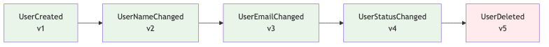
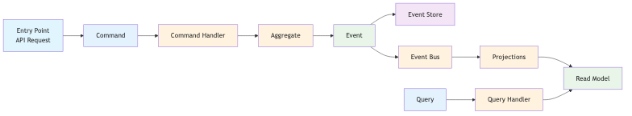
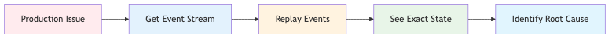

# How I Learned to Stop Worrying and Love Raw Events

## Event Sourcing & CQRS with FastAPI and Celery

**Antonis Markoulis** | Senior Staff Engineer @ Orfium
**PyCon Athens 2025**

<!--
Hello everybody! I'm super excited to be presenting at PyCon Athens. This is the first PyCon in Greece, so it's truly an honor to be part of this inaugural event.

I'm Antonis Markoulis, Senior Staff Engineer at Orfium, where I work with multiple teams and am responsible for technical growth and software quality across the organization. I've been coding in Python for over 10 years, and I love solving complex distributed systems problems.

Today I want to share with you how we solved a real production nightmare using event sourcing and CQRS with familiar Python tools like FastAPI and Celery. Let me start with the problem that led us to this solution.
-->


---

# The Nightmare: "Who Deleted My User?"

## A real debugging story:

```python
def delete_user(user_id: int):
    db.delete_user(user_id)
```

## The problem:
**Monday 3:47 PM**: "Sarah's account is missing!"
**Tuesday 9:15 AM**: "When was it deleted? Who did it? Why?"

## What we can't answer:
- ❌ **When** was the user deleted?
- ❌ **Who** deleted the user?
- ❌ **Why** was it deleted?

## **The system has no memory of what happened**

<!--
This is a story that probably sounds familiar to many of you. Monday 3:47 PM - someone reports that Sarah's account is missing. Tuesday 9:15 AM - we're still trying to figure out when it was deleted, who did it, and why. With traditional systems, we can't answer any of these questions.

Why is that? Usually we have one row per entity in our relational database and we update on top of it. In the case of hard delete, we lose the entry completely. If we have soft delete, we know when it was deleted using deleted_at, maybe who using updated_by, but in most cases we miss the reason or the different states the user was in. The system has no memory of what happened. This is the nightmare we all face when debugging production issues with classic architectures.

This is exactly the problem that event sourcing solves - by storing every change as an immutable event, we can answer all these questions.
-->


---

# Core Concepts: Events

## Immutable Facts

**Events are immutable facts** that represent state changes in the system.

## Example:
**User Created Event** - John Doe, john@example.com, March 15

## Key characteristics:
- **Immutable**: Once created, events never change
- **Facts**: They represent what actually happened
- **Complete**: Each event contains all necessary data
- **Revisioned**: Events have sequence numbers for ordering
- **Versioned**: Events have schema versions for serialization

## Key principle: **Events are immutable facts** - they never change

<!--
So how do we solve the "Who deleted my user?" problem? We combine Event Sourcing with CQRS - two powerful patterns that work together perfectly.

Event Sourcing means we store every change as an immutable event. Instead of deleting data forever, we record what happened. CQRS means we separate our command logic (what changes the system) from our query logic (what reads the system).

Together, this gives us complete audit trails and optimized read models. Let's understand the building blocks, starting with Events.

Every change in our system becomes an immutable event. Here's what a UserCreated event looks like - it has an event_id, aggregate_id, timestamp, event_type, and the actual data. The key principle is that events are immutable facts - they never change once created. This is what gives us the audit trail we need for debugging.
-->

---


# Core Concepts: Event Store & Streams

## Source of Truth

**Event Store** is append-only storage where events are organized in **streams per aggregate**.

## Example:


## Key characteristics:
- **Append-only**: Events are never modified or deleted
- **Streams per aggregate**: Each user has their own ordered event stream
- **Immutable**: Once written, events are permanent
- **Replayable**: Can rebuild any point in time from the stream

## **The stream is the source of truth** - rebuild any point in time

<!--
Where do we store all these events? The Event Store is the append-only storage for all events in the system, organized in streams per aggregate. Here's a user's complete story: UserCreated, UserNameChanged, UserEmailChanged, UserStatusChanged, and finally UserDeleted.

The stream is the source of truth - we can rebuild any point in time by replaying these events in order. This is how we get time travel capabilities. Operations are simple: store new events, read in order, never modify. Events are immutable - once written, they're permanent. This gives us optimistic concurrency control.

Now that we understand where events are stored, let's look at how we actually create them. Commands are the entry point for all changes.
-->


---

# Core Concepts: Commands

## Intent to Change

**Commands represent the intent** to change the system state.

## Example:
**"Create a new user account"**

## Key characteristics:
- **Intent**: They express what we want to happen
- **Validation**: Can be validated before execution
- **Idempotent**: Safe to retry if needed
- **Entry point**: The starting point for all changes

## **Commands are the entry point** - they represent what we want to do

<!--
Now, how do we actually change the system? Commands represent the intent to change the system state. They express what we want to happen - like 'Create a new user account'. Commands can be validated before execution, are idempotent for safety, and serve as the entry point for all changes. This is the command side of CQRS.

Commands create events, but how do we read the data? That's where queries come in - the other side of CQRS.
-->


---

# Core Concepts: Queries

## Intent to Read (CQRS Separation)

**Queries represent the intent** to read data from the system.

## Example:
**"Show me user John Doe's profile"**

## Key characteristics:
- **Read-only**: They never change system state
- **Optimized**: Designed for specific read patterns
- **Separate models**: Different from command models (CQRS)

## **Queries are separate from commands** - different models for different purposes

<!--
On the other hand, queries represent the intent to read data from the system. They're read-only, optimized for specific patterns, use separate models from commands, and are designed for fast retrieval. This is the query side of CQRS - completely separate from the command side.

So we have commands that create events, and queries that read data. But where does the business logic live? That's where aggregates come in - they contain the domain logic and apply business rules.
-->

---

# Core Concepts: Aggregates

## Domain Logic

**Aggregates contain domain logic** and apply business rules to create events.

## Example:
- User email must be unique
- Cannot delete already deleted user

## Key characteristics:
- **Business rules**: Enforce domain-specific validation
- **State management**: Maintain current state from events
- **Event creation**: Generate new events based on commands

## **Aggregates apply business logic** and create events

<!--
Now, where does the business logic live? Aggregates contain domain logic and apply business rules to create events. They enforce domain-specific validation like 'User email must be unique' and 'Cannot delete already deleted user'. When rules pass, they create events. When rules fail, they return errors. This ensures business invariants are maintained.
-->

---


# Core Concepts: Projections

## Building Read Models

**Projections build optimized read models** from events for fast querying.

## Example:
- Event: User Created → Action: Create user record
- Event: Email Changed → Action: Update email field

## Key characteristics:
- **Event-driven**: Triggered by new events
- **Read-optimized**: Designed for specific query patterns
- **Denormalized**: Optimized for performance, not normalization
- **Eventually consistent**: Updated asynchronously

## **Projections update read models from events**

<!--
Finally, how do we build fast read models? Projections build optimized read models from events for fast querying. When a UserCreated event happens, we create a user record. When EmailChanged happens, we update the email field. This gives us event-driven read model updates that are optimized for queries and eventually consistent.
-->

---

# How Everything Works Together

## The complete flow:



## **Two paths: Commands (Write) and Queries (Read)**

<!--
Now that we understand all the building blocks, here's how everything connects in a real-world example. The diagram shows two distinct paths:

**Command Path (Write)**: User makes an API call to change password. This goes to our FastAPI command endpoint, which creates a ChangePasswordCommand and passes it to the command handler. The command handler loads all events for this user from the event store, creates a UserAggregate, and replays all events to rebuild the current state. Then it calls the domain method change_password, which validates business rules and generates new events. These new events are stored in the event store and dispatched to the event handler. The event handler maps the event type to Celery tasks and sends them to the message queue. Celery workers pick up these tasks and call the appropriate projections. The projections update the read models with the new data.

**Query Path (Read)**: When another user makes a query API call to get user data, it goes to our FastAPI query endpoint, which uses the query handler to fetch data directly from the read models - the same data that was just updated by the projections.

This is CQRS in action - commands go through the full event sourcing pipeline, queries read directly from optimized read models. Same API entry point, completely different paths.
-->

---

# FastAPI: Command & Query Interface

## Commands (Write) - Entry Point

```python
@router.post("/users/{user_id}/change-password/")
async def change_password(
    user_id: UUID,
    password_data: ChangePasswordDTO,
    handler: ChangePasswordCommandHandler = Depends(InfraFactory.create_change_password_command_handler)
) -> ChangePasswordResponseDTO:
    command = ChangePasswordCommand(user_id=user_id, password_data=password_data)
    await handler.handle(command)
    return ChangePasswordResponseDTO(success=True, message="Password updated successfully")
```

## Queries (Read) - CQRS Separation

```python
@users_router.get("/{user_id}/")
async def get_user(
    user_id: UUID,
    query_handler: GetUserQueryHandler = Depends(InfraFactory.create_get_user_query_handler)
) -> UserReadDTO:
    return await query_handler.handle(GetUserQuery(user_id=user_id))
```

## **CQRS separation in action** - different endpoints for different purposes

<!--
Now let's see how the Python ecosystem implements this architecture. Here's how we implement this with FastAPI. We define our endpoints to accept user data. We create commands using Pydantic models for validation. When a request comes in, we create a CreateUserCommand, get the appropriate handler from our infrastructure factory, and process the command. Notice we return immediately - we don't wait for the event to be processed. This gives us high availability and responsiveness.

For queries, we have separate endpoints that read from optimized read models. This is CQRS in action - commands write to the event store, queries read from optimized read models. The same API, different responsibilities.
-->

---

# Command Handlers: Business Logic

## How we structure command processing:

```python
class ChangePasswordCommandHandler(CommandHandler[ChangePasswordCommand]):
    async def handle(self, command: ChangePasswordCommand) -> None:
        # Retrieve all events for this aggregate
        events = await self.event_store.get_stream(command.user_id)

        # Create aggregate and replay events
        user = UserAggregate(command.user_id)
        for event in events:
            user.apply(event)

        # Call domain method and get new events
        new_events = user.change_password(command.password_data.current_password, command.password_data.new_password)

        # Persist and dispatch events using unit of work
        async with self.uow:
            await self.event_store.append_to_stream(command.user_id, new_events)
            await self.event_handler.dispatch(new_events)
```

## **Command Handler orchestrates: Event Store + Event Handler with Unit of Work**

<!--
Behind the API, command handlers are where the business logic lives. Here's our ChangePasswordCommandHandler with stream-based operations. The handle method loads the existing aggregate from the stream, reconstructs the state by applying all previous events, calls the domain method to validate and create an event, applies the event to the aggregate, appends to the stream with revision checking for concurrency control, and publishes it to the event bus. This gives us clean separation between business logic and infrastructure concerns.
-->

---

# Event Handler: Celery Integration

## How events are dispatched to Celery tasks:

```python
class CeleryEventHandler(EventHandler):
    def __init__(self):
        # Map event types to Celery tasks
        self.event_handlers: Dict[EventType, List[str]] = {
            EventType.USER_CREATED: [
                "process_user_created_task",
                "send_welcome_email_task"
            ],
            EventType.USER_PASSWORD_CHANGED: [
                "process_password_changed_task",
                "send_security_notification_task"
            ],
            # ... other event types
        }

    async def dispatch(self, events: List[Event]) -> None:
        for event in events:
            for task_name in self.event_handlers[event.event_type]:
                # All tasks receive the same event payload structure
                celery_app.send_task(task_name, kwargs={"event": event.model_dump()})
```

## **Event Handler dispatches to message queues, Celery tasks handle messages and call projections**

<!--
Once events are created, the Event Handler dispatches them to message queues. Here's our CeleryEventHandler that maps event types to Celery tasks. When a USER_CREATED event comes in, it triggers process_user_created_task and send_welcome_email_task. The dispatch method sends each task to Celery with the event data. This gives us scalable, async event processing.
-->

---

# Celery Tasks: Event Processing

## How Celery tasks process events and call projections:

```python
@app.task(
    name="process_user_created_task",
    bind=True,
    max_retries=3,
    acks_late=True,
    autoretry_for=(Exception,),
    retry_backoff=True,
    retry_jitter=True
)
def process_user_created_task(self, event: Dict[str, Any]) -> None:
    """Celery task for processing USER_CREATED events"""
    # Get infrastructure factory
    factory = get_infrastructure_factory()

    # Get projection
    projection = factory.create_user_created_projection()

    # Process the event using async_to_sync
    async_to_sync(projection.handle)(EventDTO(**event))
    logger.info(f"Successfully processed USER_CREATED event for user {EventDTO(**event).aggregate_id}")
```

## **Celery tasks use async_to_sync to bridge async projections with sync Celery**

<!--
On the receiving end, Celery tasks are wrappers that call the appropriate projection handlers. Here's how it works: we define a Celery task that receives an event, get the projection from the infrastructure factory, and use async_to_sync to convert the async projection.handle method to sync for Celery. The task is just a wrapper - the actual business logic is in the projection handlers, and async_to_sync bridges the gap between async projections and sync Celery tasks.
-->

---

# Projections: Event-Driven Read Models

## How projections build read models:

```python
class UserCreatedProjection(Projection[UserCreatedEvent]):
    async def handle(self, event: UserCreatedEvent) -> None:
        # Build read model from event
        user_data = {
            "aggregate_id": event.aggregate_id,
            "name": event.data.get("name"),
            "email": event.data.get("email"),
            "status": event.data.get("status"),
            "created_at": event.timestamp,
        }

        # Save to read model
        await self.db.save(user_data)
```

## **Projections update read models from events**

<!--
Inside the Celery tasks, projections update read models from events. Here's our UserCreatedProjection. When a user_created event comes in, we build user data with aggregate_id, name, email, and created_at. We save this to the read model. This gives us event-driven read model updates that are optimized for queries.
-->


---

# Eventual Consistency: The Real Challenge

## The story: "Update user's first name"

```python
# User updates first name
PUT /users/123/ {"first_name": "John"}
# API returns success immediately
# But read model might not be updated yet
```

## Two approaches to handle this:

### 1. Optimistic Updates (Naive)
### 2. Outbox Pattern (Advanced)


## **Eventual consistency requires thoughtful UI design**

<!--
Now, let's talk about the real challenge of eventual consistency. Here's a concrete example: a user updates their first name. The API returns success immediately, but the read model might not be updated yet. This creates a real UI challenge. I've seen two approaches to handle this. The naive approach is optimistic updates - the frontend updates the UI immediately, but if the user refreshes, they might see old data. The more advanced approach is the outbox pattern - we store events in an outbox table with job status, track processing status like pending, processing, completed, or failed, and create views of unprocessed events. This gives us clear visibility into what's been processed versus what's still pending. Eventual consistency requires thoughtful UI design.
-->

---

# Performance with Snapshots

## The performance challenge:

```python
    async def handle(self, command: ChangePasswordCommand) -> None:
        events = await self.event_store.get_stream(command.user_id)  # 10,000 events!
        user = UserAggregate(command.user_id)
        for event in events:
            user.apply(event)  # Takes 5 seconds 😱
```

## The solution: Snapshots in Command Handler

```python
    async def handle(self, command: CreateUserCommand) -> None:
        try:
            snapshot = await self.snapshot_store.get_latest_snapshot(command.user_id)
            recent_events = await self.event_store.get_events_since_snapshot(command.user_id, snapshot.revision)
            user = UserAggregate.from_snapshot(snapshot)
            for event in recent_events:
                user.apply(event)
        except SnapshotNotFound:
```

## **Snapshots require aggregate changes** - rebuild state efficiently

<!--
Another concern is performance - what if you have thousands of events? Here's the problem: replaying 10,000 events takes 5 seconds. The solution is snapshots, but this requires changes to our command handlers. We try to get the latest snapshot first, and if it exists, we rebuild the aggregate from the snapshot and apply only the recent events. If no snapshot exists, we fall back to getting all events - this handles the case where snapshots haven't been created yet. This gives us the best of both worlds - performance when snapshots exist, and correctness when they don't. The key insight is that snapshots require proper error handling in the command handlers.
-->

---

# Error Handling & Retries: Two Different Worlds

## Commands (Synchronous) - API Failures:

```python
# Unit of Work ensures atomicity
async with self.uow:
    await self.event_store.append_to_stream(user_id, new_events)
    await self.event_handler.dispatch(new_events)
# Either succeeds or fails - API gets 500
```

## Projections (Asynchronous) - Celery Retries:

```python
# Celery handles retries with late acknowledgment
@app.task(bind=True, max_retries=3, acks_late=True)
def process_user_created_task(self, event: Dict[str, Any]) -> None:
    projection.handle_user_created(event)
```

## **Different strategies for different failure modes**

<!--
Now let's talk about error handling and retries, which are actually two different worlds. For commands - the synchronous API calls - we use Unit of Work to ensure atomicity. Either the event is stored and dispatched, or it fails completely and the API returns a 500. There's no retry here - it's all or nothing. For projections - the asynchronous Celery tasks - we use Celery's built-in retry mechanisms with late acknowledgment. Messages are never lost, but idempotence is critical because the same message can arrive multiple times. This actually enables powerful capabilities like backfill tasks that can reprocess all events from the event store.
-->

---

# Debugging Superpowers: Testing Business Logic

## The story: "What was the user's state at 3:47 PM?"



```python
# Test business logic with real production data
def test_incident_scenario(user_id: str, incident_time: datetime):
    """Test what would happen if we applied a specific event at a point in time"""
    events = event_store.get_events_before(user_id, incident_time)
    user = UserAggregate(user_id)

    # Rebuild exact state at incident time
    for event in events:
        user.apply(event)

    # Test the problematic event that caused the issue
    result = user.apply(UserSuspendedEvent(user_id, reason="fraud_detected"))

    # Assert the expected behavior
    assert result.is_success, f"User should be suspended: {result.error}"
    assert user.status == "suspended"
    print(f"✅ Test passed: User {user_id} would be suspended at {incident_time}")
```

## **Test business logic with real production data**

<!--
Now, this is where event sourcing really shines - testing business logic at specific points in time. Instead of trying to recreate scenarios in test environments, we can rebuild the exact state at any moment in history. Here's how it works: we get all events before a specific incident time, rebuild the aggregate state at that exact moment, and then apply the problematic event that caused the issue - like a UserSuspendedEvent. This lets us see exactly what the business rules would do when that event is applied, and understand why certain actions were allowed or blocked. This gives us the ability to debug issues that happened hours or days ago, and test business logic against real production data at any point in time. This is debugging and testing superpowers combined.
-->

---

# Summary: Key Takeaways

## 🚀 Start Simple
- No fancy event stores needed initially
- Familiar tools, powerful results

## ⚠️ When NOT to use Event Sourcing
- **Simple CRUD** or **high-frequency systems** (immediate consistency needed)
- **Teams without distributed systems experience**

## 🎯 What you gain
- **Complete audit trail** & time travel
- **Debugging superpowers** with real production data
- **Scalability** with eventual consistency

## **Event sourcing + Python ecosystem = distributed systems superpowers**

<!--
Let me end with some practical advice. Start simple - you don't need fancy technology from day one. PostgreSQL as your event store and read database is sufficient for most cases. SQS as your event bus works great for most applications. You don't need Kurrent for event store or Elasticsearch and MongoDB for read models initially. This architecture can be easily adopted with familiar tools.

When NOT to use event sourcing? Simple CRUD with basic audit needs - traditional logging suffices. High-frequency trading systems need immediate consistency. Teams without distributed systems experience will struggle with the learning curve.

What you gain: complete audit trail, time travel capabilities, debugging superpowers with real production data, and scalability with eventual consistency patterns.

The Python ecosystem with FastAPI and Celery is more than capable of solving even the most complex distributed systems challenges. This combination gives you the tools to build systems that can explain themselves.
-->

---

# Thank You!

## Q & A

**Let's Connect!**

**GitHub**: github.com/anmarkoulis
**LinkedIn**: linkedin.com/in/anmarkoulis
**Dev.to**: dev.to/markoulis

<!--
Thank you all for your attention. I hope I've convinced you that raw events are worth loving. I'm happy to take questions and discuss any aspect of event sourcing, CQRS, or the Python ecosystem. Let's have a great discussion!
-->
