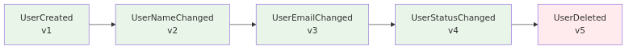
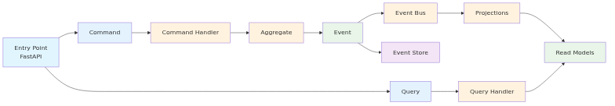
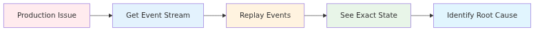

# How I Learned to Stop Worrying and Love Raw Events

## Event Sourcing & CQRS with FastAPI and Celery

**Antonis Markoulis** | Senior Staff Engineer @ Orfium
**PyCon Athens 2025**

<!--Hello everybody! I'm excited to be presenting at PyCon Athens. This is the first PyCon in Greece, so it's truly an honor to be part of this inaugural event.

I'm Antonis Markoulis, a Senior Staff Engineer at Orfium where I focus on elevating technical standards across the organization and engineering teams. I've been coding in Python professionally for over 10 years, and I'm passionate about building robust, scalable systems.

Today, I want to share how we can solve complex distributed systems problems using event sourcing and CQRS with familiar Python tools like FastAPI and Celery. Let me start with a real-world problem that illustrates why we need this solution.
-->


---

# The Nightmare: "Who Deleted My User?"

## A real debugging story:

```python
def delete_user(user_id: int):
    db.delete_user(user_id)
```

## The problem:
**Monday 3:47 PM**: "Sarah's account is missing!"
**Tuesday 9:15 AM**: "When was it deleted? Who did it? Why?"

## What we can't answer:
- ❌ **When** was the user deleted?
- ❌ **Who** deleted the user?
- ❌ **Why** was it deleted?

## **The system has no memory of what happened**

<!--
This is a story that probably sounds familiar to many of you. Monday afternoon - someone reports that Sarah's account is missing. Tuesday morning - we're still trying to figure out when it was deleted, who did it, and why. With traditional systems, we can't answer any of these questions.

Why is that? Usually we have one row per entity in our relational database and we update on top of it. In the case of hard delete, we lose the entry completely. If we have soft delete, we know when it was deleted using deleted_at, maybe who using updated_by, but in most cases we miss the reason or the different states the user was in. The system has no memory of what happened. This is the nightmare we all face when debugging production issues with classic architectures.

This is exactly the problem that event sourcing solves.
-->


---

# Core Concepts: Events

## Immutable Facts

**Events are immutable facts** that represent state changes in the system.

## Event Structure:
```
id: 550e8400-e29b-41d4-a716-446655440000
aggregate_id: 123e4567-e89b-12d3-a456-426614174000
event_type: USER_DELETED
version: 1
timestamp: 2024-03-15T16:47:23Z
revision: 5
data:
  deleted_by: admin@company.com
  reason: User requested account deletion
  deleted_at: 2024-03-15T16:47:23Z
```

## Key principle: **Events are immutable facts** - they never change

<!--
So how do we solve the "Who deleted my user?" problem? We combine Event Sourcing with CQRS - two powerful patterns that work together perfectly.

Event Sourcing means we store every change as an immutable event. Instead of deleting data forever, we record what happened. CQRS means we separate our command logic (what changes the system) from our query logic (what reads the system).

Together, this gives us complete audit trails and optimized read models. Let's understand the building blocks, starting with Events.

Every change in our system becomes an immutable event. Here's what a UserDeleted event looks like - it has an event_id, aggregate_id, timestamp, event_type, version, revision, and the actual data. The key principle is that events are immutable facts - they never change once created.

The version field represents the event schema version, allowing us to evolve our event structure over time while maintaining backward compatibility. The revision field represents the position of this event in the aggregate's event stream, ensuring we can replay events in the correct order.

This is what gives us the audit trail we need for debugging - we can see exactly when, why, and by whom the user was deleted, along with the complete sequence of events that led to that state.
-->

---


# Core Concepts: Event Store & Streams

## Source of Truth

**Event Store** is append-only storage where events are organized in **streams per aggregate**.

## Example:


## Key characteristics:
- **Append-only**: Events are never modified or deleted
- **Streams per aggregate**: Each user has their own ordered event stream
- **Immutable**: Once written, events are permanent
- **Replayable**: Can rebuild any point in time from the stream

## **The stream is the source of truth** - rebuild any point in time

<!--
Where do we store all these events? The Event Store is the append-only storage for all events in the system, organized in streams per aggregate. Here's a user's complete story: UserCreated, UserNameChanged, UserEmailChanged, UserStatusChanged, and finally UserDeleted.

The stream is the source of truth - we can rebuild any point in time by replaying these events in order. This is how we get time travel capabilities. Operations are simple: store new events, read in order, never modify. Events are immutable - once written, they're permanent.

This is the key insight: **the event stream is the single source of truth**. Everything else - read models, projections, even the current state - is derived from this immutable event log. This gives us complete confidence in our data and the ability to audit every change that ever happened.

Now that we understand where events are stored, let's look at how we actually create them. Commands are the entry point for all changes.
-->


---

# Core Concepts: Commands

## Intent to Change

**Commands represent the intent** to change the system state.

## Example:
**"Create a new user account"**

## Key characteristics:
- **Intent**: They express what we want to happen
- **Validation**: Can be validated before execution
- **Idempotent**: Safe to retry if needed
- **Entry point**: The starting point for all changes

## **Commands are the entry point** - they represent what we want to do

<!--
Now, how do we actually change the system? Commands represent the intent to change the system state. They express what we want to happen - like 'Create a new user account'. Commands can be validated before execution - we check that all required fields are present, data types are correct, and business rules are satisfied. They are idempotent for safety, and serve as the entry point for all changes.

When a command is executed, it creates events that get stored in the event store. This is the command side of CQRS - commands write to the event store by creating events.

But how do we read the data? That's where queries come in - the other side of CQRS.
-->


---

# Core Concepts: Queries

## Intent to Read (CQRS Separation)

**Queries represent the intent** to read data from the system.

## Example:
**"Show me user John Doe's profile"**

## Key characteristics:
- **Read-only**: They never change system state
- **Separate models**: Different from command models (CQRS)
- **Optimized for access patterns**: Denormalized for performance, not normalization

## **Queries are separate from commands** - different models for different purposes

<!--
On the other hand, queries represent the intent to read data from the system. They're read-only, use separate models from commands, and are optimized for specific access patterns - the read models are denormalized for performance rather than following database normalization rules. This is the query side of CQRS - completely separate from the command side.

So we have commands that create events, and queries that read data. But where does the business logic live? That's where aggregates come in - they contain the domain logic and apply business rules.
-->

---

# Core Concepts: Aggregates

## Domain Logic

**Aggregates contain domain logic** and apply business rules to create events.

## Example:
- User email must be unique
- Cannot delete already deleted user

## Key characteristics:
- **Business rules**: Enforce domain-specific validation
- **Event replay**: Rebuild current state by applying all previous events
- **Event creation**: Generate new events based on commands

## **Aggregates apply business logic** and create events

<!--
Now, where does the business logic live? Aggregates contain domain logic and apply business rules to create events. First, we rebuild the aggregate's current state by applying all previous events from the event store. Once the aggregate is up-to-date, we call a business logic method that validates the command against business rules like 'User email must be unique' and 'Cannot delete already deleted user'. When rules pass, the method creates new events. When rules fail, it returns errors. This ensures business invariants are maintained while keeping the aggregate state current.

So now we have events being created by aggregates. But these events are just stored in the event store - they don't automatically update our read models. That's where projections come in - they listen to these events and build the optimized read models that our queries will use.
-->

---


# Core Concepts: Projections

## Building Read Models

**Projections build optimized read models** from events for fast querying.

## Example:
- Event: User Created → Actions:
  - Create user record (read model)
  - Send welcome email (side effect)

## Key characteristics:
- **Event-driven**: Triggered by new events
- **Multiple actions per event**: One event can trigger multiple projections
- **Eventually consistent**: Updated asynchronously

## **Projections update read models from events**

<!--
So projections are the bridge between events and read models. They listen to events from the event store and build optimized read models for fast querying. When a UserCreated event happens, we create a user record. When EmailChanged happens, we update the email field. This gives us event-driven read model updates that are optimized for queries and eventually consistent.

A key benefit is that one event can trigger multiple projections - the same UserCreated event might create a user record in the read model, send a welcome email, create an audit log entry, and trigger analytics tracking. This decoupling allows us to add new behaviors without changing existing code.
-->

---

# How Everything Works Together

## The complete flow:



## **Two paths: Commands (Write) and Queries (Read)**

<!--
Now that we understand all the building blocks, here's how everything connects in a real-world example. The diagram shows two distinct paths:

**Command Path (Write)**: User makes an API call to change password. This goes to our FastAPI command endpoint, which creates a ChangePasswordCommand and passes it to the command handler. The command handler is the orchestrator of the process - it retrieves all previous events for this user from the event store, creates a UserAggregate, and passes all those events to the aggregate so it can rebuild its current state. Then it calls the aggregate's business method change_password, which validates business rules and generates new events. These new events are stored in the event store and dispatched to the event bus. The event handler then processes these events and updates the read models.

**Query Path (Read)**: When another user makes a query API call to get user data, it goes to our FastAPI query endpoint, which uses the query handler to fetch data directly from the read models - the same data that was just updated by the event processing.

This is CQRS in action - commands go through the full event sourcing pipeline, queries read directly from optimized read models. Same API entry point, completely different paths.
-->

---

# FastAPI: Command & Query Interface

## Commands vs Queries

```python
@router.post("/users/{user_id}/change-password/")
async def change_password(
    user_id: UUID,
    password_data: ChangePasswordDTO,
    handler: ChangePasswordCommandHandler = Depends(InfraFactory.create_change_password_command_handler)
) -> ChangePasswordResponseDTO:
    command = ChangePasswordCommand(user_id=user_id, password_data=password_data)
    await handler.handle(command)
    return ChangePasswordResponseDTO(success=True, message="Password updated successfully")

@users_router.get("/{user_id}/")
async def get_user(
    user_id: UUID,
    query_handler: GetUserQueryHandler = Depends(InfraFactory.create_get_user_query_handler)
) -> UserReadDTO:
    return await query_handler.handle(GetUserQuery(user_id=user_id))
```

## **CQRS separation in action** - different endpoints for different purposes

<!--
Now that we understand the architecture, let's see how to implement it. The Python ecosystem provides everything we need to implement event sourcing with CQRS. FastAPI gives us the web framework, Pydantic handles data validation and serialization, and dependency injection manages our handlers. We don't need complex enterprise frameworks - familiar Python tools are more than capable.

So how do we turn this architecture into working code? We leverage FastAPI's dependency injection system to automatically pick the proper handler for each endpoint. Our APIs are very simple - they use Pydantic models for both the request payloads and the internal commands/queries. When a request comes in, we create the appropriate command or query object using Pydantic, get the handler from our infrastructure factory through dependency injection, and simply call its handle method.

The beauty is in the simplicity: commands and queries are just Pydantic models, handlers are injected automatically, and the endpoints focus purely on HTTP concerns. This gives us clean separation between the web layer and our domain logic.
-->

---

# Command Handlers: Orchestration Logic

## How we structure command processing:

```python
class ChangePasswordCommandHandler(CommandHandler[ChangePasswordCommand]):
    async def handle(self, command: ChangePasswordCommand) -> None:
        # Retrieve all events for this aggregate
        events = await self.event_store.get_stream(command.user_id)

        # Create aggregate and replay events
        user = UserAggregate(command.user_id)
        for event in events:
            user.apply(event)

        # Call domain method and get new events
        new_events = user.change_password(command.password_data.current_password, command.password_data.new_password)

        # Persist and dispatch events using unit of work
        async with self.uow:
            await self.event_store.append_to_stream(command.user_id, new_events)
            await self.event_handler.dispatch(new_events)
```

## **Command Handler orchestrates: Event Store + Event Handler with Unit of Work**

<!--
Behind the API, command handlers are the orchestrators - they don't contain business logic, they delegate and coordinate. Here's our ChangePasswordCommandHandler: it leverages the event store to retrieve all existing events for the user, creates a UserAggregate and replays events to reconstruct its current state, calls the aggregate's business method to produce new events, and then handles both storage and dispatch.

The Unit of Work pattern (`async with self.uow:`) is crucial here - it ensures that both storing events to the event store AND dispatching them to the event bus happen atomically. If either operation fails, the entire transaction is rolled back. This prevents the nightmare scenario where events are stored but never processed, or processed but never stored. The key insight is that command handlers orchestrate the process with transactional guarantees, while the actual business logic lives in the aggregates.
-->

---

# Aggregates: Pure Python Business Logic

## The heart of event sourcing - pure domain objects:

```python
class UserAggregate(Aggregate):
    """User domain aggregate - encapsulates user business logic"""

    def change_password(self, new_password_hash: str) -> List[EventDTO]:
        """Change user's password"""
        # Business rules and event creation logic here
        pass

    def apply(self, event: EventDTO) -> None:
        """Apply a domain event to the user aggregate state"""
        if event.event_type == EventType.PASSWORD_CHANGED:
            self._apply_password_changed_event(event)
        # ... other event types
```

## **Aggregates are pure Python classes that contain business rules and produce events**

<!--
Now, where does the actual business logic live? It's in the aggregates - a concept borrowed from Domain-Driven Design (DDD). Aggregates are pure Python classes that contain all the business rules and domain logic. They don't have any dependencies on infrastructure, databases, or external services. They just take commands (like change_password) and produce events (like PASSWORD_CHANGED). The apply method is crucial for event sourcing - it's how we reconstruct the aggregate's current state by replaying all previous events. This gives us a clean separation between business logic and infrastructure concerns.
-->

---

# Event Handler: Celery Integration

## How events flow from aggregates to async processing:

```python
class CeleryEventHandler(EventHandler):
    def __init__(self):
        # Map event types to Celery tasks
        self.event_handlers: Dict[EventType, List[str]] = {
            EventType.USER_CREATED: [
                "process_user_created_task",
                "send_welcome_email_task"
            ],
            # ... other event types
        }

    async def dispatch(self, events: List[Event]) -> None:
        for event in events:
            for task_name in self.event_handlers[event.event_type]:
                # All tasks receive the same event payload structure
                celery_app.send_task(task_name, kwargs={"event": event.model_dump()})
```

## **Event Handler maps events to Celery tasks, enabling scalable async processing**

<!--
So now we have aggregates producing events, but what happens to those events? In event sourcing, we publish events to an event bus, and then another process picks them up to trigger projections and side effects. This is where Celery comes in - it's Python's most popular distributed task queue that can handle both the message queuing and task execution.

Our CeleryEventHandler acts as the bridge between our domain events and Celery. It maps each event type to one or more Celery tasks. For example, when a USER_CREATED event is produced by the aggregate, it gets mapped to both "process_user_created_task" (which updates read models) and "send_welcome_email_task" (which sends emails). This mapping is crucial - it's how we define what should happen when each type of event occurs.

The beauty of this approach is that we can easily add new side effects by just adding new tasks to the mapping, without touching the aggregate or command handler code. This gives us a clean separation between business logic (aggregates), orchestration (command handlers), and side effects (Celery tasks).
-->

---

# Celery Tasks: Event Processing

## How Celery tasks process events and call projections:

```python
@app.task(
    name="process_user_created_task", bind=True, acks_late=True,
)
def process_user_created_task(self, event: Dict[str, Any]) -> None:
    """Celery task for processing USER_CREATED events"""
    # Get infrastructure factory
    factory = get_infrastructure_factory()

    # Get projection
    projection = factory.create_user_created_projection()

    # Process the event using async_to_sync
    async_to_sync(projection.handle)(EventDTO(**event))
    logger.info(f"Successfully processed USER_CREATED event for user {EventDTO(**event).aggregate_id}")
```

## **Celery tasks use async_to_sync to bridge async projections with sync Celery**

<!--
On the receiving end, Celery tasks are wrappers that call the appropriate projection handlers. Here's how it works: we define a Celery task that receives an event, get the projection from the infrastructure factory, and use async_to_sync to convert the async projection.handle method to sync for Celery. The task is just a wrapper - the actual business logic is in the projection handlers, and async_to_sync bridges the gap between async projections and sync Celery tasks.

But reliability is crucial here. Notice the `acks_late=True` parameter - this means Celery won't acknowledge the message until the task completes successfully. If the task fails, the message goes back to the queue for retry. We leverage Celery's powerful retry mechanism with exponential backoff and jitter to handle transient failures gracefully. This ensures that every event gets processed eventually, even if there are temporary issues with the database, network, or other dependencies. The combination of `acks_late`, retries, and exponential backoff gives us robust event processing that can handle real-world failures.
-->

---

# Projections: Event-Driven Read Models

## How projections build read models:

```python
class UserCreatedProjection(Projection[UserCreatedEvent]):
    async def handle(self, event: UserCreatedEvent) -> None:
        # Build read model from event
        user_data = {
            "aggregate_id": event.aggregate_id,
            "name": event.data.get("name"),
            "email": event.data.get("email"),
            "status": event.data.get("status"),
            "created_at": event.timestamp,
        }

        # Save to read model
        await self.db.save(user_data)
```

## **Projections update read models from events**

<!--
So now we have Celery tasks processing events, but what do they actually do? They call projections - specialized handlers that update read models from events. Projections are the final piece of the event sourcing puzzle - they take events and transform them into optimized read models for fast querying.

Here's our UserCreatedProjection. When a user_created event comes in, we extract the relevant data (aggregate_id, name, email, created_at) and save it to the read model. The key architectural insight here is that projections use the repository pattern - they don't know or care about the specific storage implementation (PostgreSQL, MongoDB, Redis, etc.). They just call `self.db.save()` and let the repository handle the details.

This separation of concerns is crucial. Projections focus solely on one thing: ensuring the read model is properly updated from events. They don't handle business logic (that's the aggregate's job), they don't orchestrate the process (that's the command handler's job), and they don't manage storage details (that's the repository's job). This single responsibility makes projections easy to test, maintain, and reason about.
-->


---

# Eventual Consistency: The Real Challenge

## The story: "Sarah's name change confusion"

**Monday 3:47 PM**: Sarah updates her name from "Sarah" to "Sara"
```python
PUT /users/123/ {"first_name": "Sara"}
```

**Monday 3:48 PM**: Sarah submits the form
- **Frontend calls backend, still shows**: "Sarah"
- **Sarah thinks**: "Did it work? 🤔"

## Two approaches to handle this:

### 1. Optimistic Updates (Naive)
### 2. Outbox Pattern (Advanced)

## **Eventual consistency requires thoughtful UI design**

<!--
So far, we've covered the core concepts of event sourcing and CQRS, how they map to Python with FastAPI and Celery, and the complete flow from commands to events to read models. But now let's talk about the real-world challenges that emerge when you actually run this architecture in production.

This is a realistic scenario that commonly occurs in event sourcing systems. Sarah updated her name from "Sarah" to "Sara", the API returned success immediately, but when the frontend called the backend to get the updated data, it still showed "Sarah". This is the reality of eventual consistency - your API says "success" but the read model might not be updated yet.

I've seen two approaches to handle this. The first approach is optimistic updates - the frontend updates the UI immediately, but if the user refreshes or calls the backend, they might see old data. This is actually the approach I've used most often in production, and for many use cases, it's proven more than sufficient. Users get immediate feedback, and the eventual consistency delay is usually acceptable.

The more advanced approach is the outbox pattern - we store events in an outbox table with job status, track processing status like pending, processing, completed, or failed, and create views of unprocessed events. This gives us clear visibility into what's been processed versus what's still pending. The outbox pattern is particularly useful when you need guaranteed processing, want to monitor event processing health, or need to handle retries and failures more explicitly.

The key insight is that eventual consistency isn't just a technical challenge - it's a UX challenge. Users expect immediate feedback, but they also expect consistency. You need to design your UI to handle this gracefully.
-->

---

# Performance with Snapshots

## The story: "The slow password change"


```python
    async def handle(self, command: ChangePasswordCommand) -> None:
        events = await self.event_store.get_stream(command.user_id)  # 10,000 events!
        user = UserAggregate(command.user_id)
        for event in events:
            user.apply(event)  # Takes 5 seconds 😱
```

## The solution: "Time travel with snapshots"

```python
    async def handle(self, command: ChangePasswordCommand) -> None:
        snapshot = await self.snapshot_store.get_latest_snapshot(command.user_id)
        events = await self.event_store.get_stream(command.user_id, start_revision=snapshot.revision)
        user = UserAggregate.from_snapshot(snapshot)
        for event in events:  # Only 50 events instead of 10,000!
            user.apply(event)
```

## **Snapshots require aggregate changes** - rebuild state efficiently

<!--
Another real-world challenge in event sourcing is performance degradation as event streams grow longer. Consider a user who has been active for 2 years and accumulated 10,000+ events. When they try to change their password, the system has to replay all those events to reconstruct their current state, which can take 5 seconds or more. This is the performance challenge of event sourcing - replaying thousands of events takes time.

The solution is snapshots - we save state every 1,000 events. Instead of replaying 10,000 events, we only replay the recent 50 events since the last snapshot. This reduces the password change time from 5 seconds to 0.5 seconds.

We try to get the latest snapshot first, and if it exists, we rebuild the aggregate from the snapshot and apply only the recent events. If no snapshot exists, we fall back to getting all events - this handles the case where snapshots haven't been created yet. This gives us the best of both worlds - performance when snapshots exist, and correctness when they don't.

The key insight is that snapshots require proper error handling in the command handlers, but the performance improvement is dramatic.
-->


---

# Debugging Superpowers: Testing Business Logic

## The story: "What was the user's state at 3:47 PM?"



```python
class TestUserAggregate(AsyncIOIsolatedTestCase):
    async def test_user_suspended(self):
        # Arrange - Apply real production events
        user = UserAggregate()
        user.apply(UserCreatedEvent("user_123", name="John", email="john@example.com"))
        user.apply(UserLoginEvent("user_123", ip="192.168.1.1"))
        user.apply(UserProfileUpdatedEvent("user_123", field="email", value="john.doe@example.com"))

        # Act - Test the problematic suspension event
        result = user.apply(UserSuspendedEvent("user_123", reason="fraud_detected"))

        # Assert
        self.assertTrue(result.is_success)
        self.assertEqual(user.status, "suspended")
```

## **Test business logic with real production data**

<!--
Another powerful benefit of event sourcing is the ability to debug issues that happened in the past. Consider a support ticket: "Why was my account suspended yesterday at 3:47 PM? I was just logging in normally! This is affecting my work!" With traditional systems, we would have said "Sorry, we can't see what happened." But with event sourcing, we can replay exactly what happened.

Instead of trying to recreate scenarios in test environments, we can rebuild the exact state at any moment in history. Here's how it works: we get all events before a specific incident time, rebuild the aggregate state at that exact moment, and then apply the problematic event that caused the issue - like a UserSuspendedEvent. This lets us see exactly what the business rules would do when that event is applied, and understand why certain actions were allowed or blocked.

This gives us the ability to debug issues that happened hours or days ago, and test business logic against real production data at any point in time. This is debugging and testing superpowers combined - we can answer "What was the user's state at 3:47 PM?" with complete certainty.

But here's the real magic: we can transform these debugging scenarios into simple unit tests without dealing with infrastructure. Since aggregates are pure Python classes, we can test business logic in complete isolation. The business rules can be tested as standalone units, replaying the exact sequence of events that caused issues in production. This means we can catch bugs before they happen and ensure our business logic behaves correctly under any scenario.
-->

---

# Summary: Key Takeaways

## 🚀 Start Simple
- No fancy event stores or event buses needed initially
- Familiar tools, powerful results

## ⚠️ When NOT to use Event Sourcing
- **Simple CRUD** or **high-frequency systems** (immediate consistency needed)
- **Teams without distributed systems experience**

## 🎯 What you gain
- **Complete audit trail** & time travel
- **Debugging superpowers** with real production data
- **Scalability** with eventual consistency

## **Python ecosystem has everything you need for distributed systems**

<!--
Let me end with some practical advice that I've learned through pain and experience. Start simple - you don't need fancy technology from day one. PostgreSQL as your event store and read database is sufficient for most cases. SQS as your event bus works great for most applications. You don't need Kafka, Kurrent for event store, or Elasticsearch and MongoDB for read models initially. This architecture can be easily adopted with familiar tools.

A word about Kafka - many people are tempted to use it as both an event bus AND event store because it seems convenient. This is an anti-pattern. Kafka is great for event streaming, but using it as your event store creates tight coupling and makes replaying events for debugging or rebuilding state extremely complex. Keep your event store (PostgreSQL) and event bus (SQS) separate.

When NOT to use event sourcing? Simple CRUD with basic audit needs - traditional logging suffices. High-frequency trading systems need immediate consistency. Teams without distributed systems experience will struggle with the learning curve.

What you gain: complete audit trail, time travel capabilities, debugging superpowers with real production data, and scalability with eventual consistency patterns.

The Python ecosystem is incredibly powerful for distributed systems. FastAPI, Celery, SQLAlchemy, Pydantic - these tools are production-ready and battle-tested. You don't need to look outside Python for distributed systems capabilities. This combination gives you everything you need to build systems that can explain themselves, scale gracefully, and handle real-world complexity.
-->

---

# Thank You!

## Q & A

**Let's Connect!**

**GitHub**: github.com/anmarkoulis
**LinkedIn**: linkedin.com/in/anmarkoulis
**Dev.to**: dev.to/markoulis

**📚 Full Implementation**: github.com/anmarkoulis/event-sourcing

<!--
Thank you all for your attention. I hope I've convinced you that raw events are worth loving.

I've shared the complete implementation on GitHub - you can see all the patterns we discussed in action: the command handlers, event handlers, projections, and the full FastAPI + Celery integration. Feel free to explore the code, run it locally, and adapt it to your own projects.

I'm happy to take questions and discuss any aspect of event sourcing, CQRS, or the Python ecosystem. Let's have a great discussion!
-->
